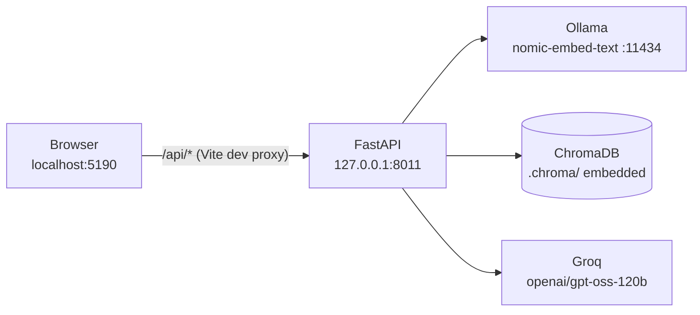
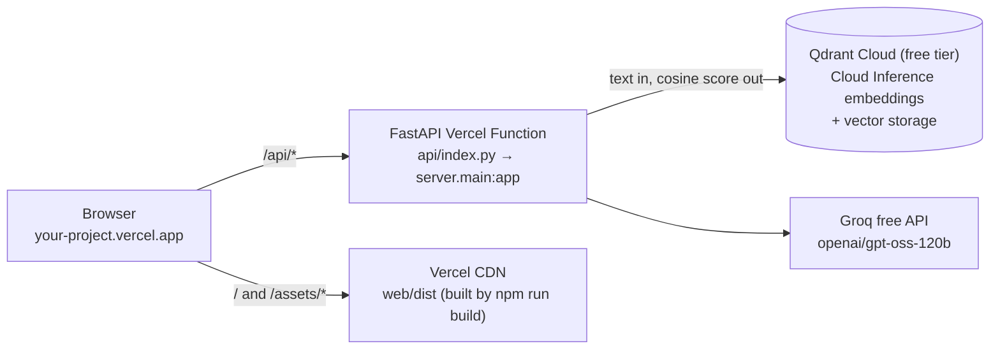

# Deploying Chapter 10 — PRD RAG Explorer to Vercel

Local development is unchanged: **Vite :5190 → FastAPI :8011 → Ollama `nomic-embed-text` → local
ChromaDB → Groq**. This document covers what was added so the *same* codebase also runs on Vercel,
where Ollama and a writable disk do not exist.

Nothing has been deployed, committed, or pushed. The commands below are for you to run.

---

## 1. Architecture

### Local (unchanged)



### Vercel (production)



There is **no** `localhost` reference in the production path — the frontend only ever calls relative
paths (`/api/health`, `/api/search`, `/api/chat`), which resolve to the function on the same domain.
No production domain is hard-coded anywhere. Every service on this diagram has a free tier, and no
paid embedding provider is involved.

**How the two coexist from one codebase:** provider selection is entirely environment-driven
(`server/config.py`), so nothing forks:

| Concern | Local default | Production value |
| --- | --- | --- |
| Embeddings | `EMBEDDING_PROVIDER=ollama` (nomic-embed-text, 768d, on this machine) | `EMBEDDING_PROVIDER=qdrant` (Qdrant Cloud Inference, free tier) |
| Vector store | `VECTOR_STORE=chroma` (embedded `.chroma/`) | `VECTOR_STORE=qdrant` (the same free cluster) |
| PDF location | read from disk next to the code | uploaded through `/api/ingest` (multipart) |
| Embedding cost | zero | zero — free Cloud Inference models on a free cluster |

---

## 2. Files created

| File | Purpose |
| --- | --- |
| `api/index.py` | The entire Vercel adapter: makes the project importable and re-exports `server.main:app`. No application logic, no duplicated routes. |
| `vercel.json` | Build command (Vite), function config (`maxDuration`, `memory`), and `excludeFiles` to keep the Python bundle small and PDF-free. |
| `.vercelignore` | Prevents uploading `.venv/`, `.chroma/`, `node_modules/`, `web/dist/`, **`*.pdf`**, **`.env`**. |
| `.python-version` | Pins the Vercel Python version to `3.13` (Vercel's default is 3.12). |
| `.env.example` | Documented template for every variable, local and production. |
| `requirements-local.txt` | Local extras (`chromadb`, `uvicorn[standard]`) layered on top of the production set. |
| `scripts/api_smoke.py` | Route-level smoke test; runs in-process (`TestClient`) or against a deployed URL (`--url`). |
| `DEPLOYMENT.md` | This file. |

## 3. Files modified

| File | Change |
| --- | --- |
| `server/config.py` | Added `EMBEDDING_PROVIDER` (`ollama`\|`qdrant`), `QDRANT_EMBED_MODEL`, optional `QDRANT_EMBED_DIMS`, `VECTOR_STORE` (`chroma`\|`qdrant`), `QDRANT_URL/API_KEY/COLLECTION_PREFIX/TIMEOUT`, plus `environment`, `is_vercel`, `uses_cloud_inference`, `embedding_model_name`, `embedding_dims_hint`, `qdrant_configured`. The `EMBEDDING_BASE_URL` / `EMBEDDING_API_KEY` / `EMBEDDING_DIMENSIONS` settings were **deleted**. `public_config()` reports booleans/model names only — never a key. |
| `server/embeddings.py` | Added `QdrantInferenceEmbedder` (reports the Cloud Inference model/dimensions and refuses to embed client-side) and the `get_embedder()` factory, which now offers **only free providers**. The former `HttpEmbedder`/OpenAI-compatible path was **removed**, so no paid provider can be configured or billed. `OllamaEmbedder` is untouched apart from a `provider` attribute. |
| `server/vector_store.py` | `chromadb` is now imported **lazily** (it no longer ships in the production bundle). Added `QdrantStore` implementing the same interface, and turned `get_store()` into a factory. Type hints made provider-neutral. |
| `server/main.py` | Uses `get_embedder()` / `get_store()`. `/api/health` now returns `status`, `environment`, `groq_configured`, `embedding_provider`, `vector_store` (existing keys kept for the UI). `/api/ingest` accepts **either** the original JSON body **or** a `multipart/form-data` file upload. `_resolve_collection` maps store misconfiguration to a 503 instead of a 500. |
| `server/ingest.py` | Uses `get_embedder()` instead of instantiating `OllamaEmbedder` directly. |
| `requirements.txt` | Now the **Vercel** set (no `chromadb`, no `uvicorn`), plus `python-multipart` and `qdrant-client`. |
| `.gitignore` | Added `*.pdf` (the confidential PRD), `chroma_db/`, `.vercel`, and re-included `!.env.example`. |
| `web/vite.config.js` | Documented the dev-vs-production proxy behaviour and added the same proxy to `vite preview`. `server.proxy` is dev-only and was never used by `vite build`. |
| `web/src/lib/api.js` | Added `ingestFile()` (multipart; deliberately does **not** set `Content-Type` so the browser sets the boundary). | 
| `web/src/components/IngestPanel.jsx` | Added an optional "Upload a PDF instead" file picker; with no file selected the button behaves exactly as before. |
| `web/src/App.jsx` | `handleIngest` routes to `ingestFile` when a file is present, otherwise to the original JSON call. |
| `web/src/styles.css` | Styling for `input[type=file]` so the picker matches the existing design. |
| `.vscode/tasks.json` | Setup task now installs `requirements-local.txt`; added an API smoke-test task. |

## 4. What was verified (not assumed)

* `api/index.py` imports the **existing** app: `FastAPI`, 14 routes.
* `scripts/api_smoke.py` — all checks pass in-process: health contract, `/api/config`,
  `/api/documents`, JSON ingest (13 chunks), **multipart upload ingest**, `/api/chunks`,
  `/api/chunks/{id}/vector` (768 dims), `/api/search` (3 modes, cosine cross-check), `/api/chat`
  (answer, citations, tokens, latency), and no `gsk_`/`sk-`/`Bearer ` in the health payload.
* **Misconfiguration is explicit**: with `EMBEDDING_PROVIDER=qdrant` + `VECTOR_STORE=qdrant` and no
  credentials, `/api/health` returns **200** with `status: "degraded"` and actionable warnings, and
  `/api/search` returns a clean **503** with a readable message (no stack trace). Verified, along
  with the fact that no `EMBEDDING_API_KEY` / `OPENAI_API_KEY` / `EMBEDDING_BASE_URL` setting exists
  any more.
* **`scripts/test_qdrant_inference.py`** — 33 assertions against a stubbed cluster, so the inference
  path is verified without credentials: Inference Objects are sent on upsert *and* query, the same
  model is used for both, dimension discovery/validation behaves (including the probe fallback),
  wrong-width and missing collections fail readably, and billing/rate-limit/auth errors map to
  actionable text. All pass.
* Local development after all of this: API health `status: ok`, `environment: local`,
  `embedding_provider: ollama`, `vector_store: chroma`, 13-row collection, zero warnings; the UI
  chat returned a grounded answer with working citations; the new upload path ran the full pipeline
  in the browser (`Read PDF 1.13s → Chunk 2ms → Embed 2.98s → Store 67ms`).
* Built bundle scanned for secrets: 3 files, 346 KB (334 KB JS / 12 KB CSS / 0.5 KB HTML), **no**
  `gsk_`, `GROQ_*`, `EMBEDDING_API_KEY`, `QDRANT_API_KEY`, or `api.groq.com` strings.

---

## 5. Production embedding provider — Qdrant Cloud Inference (free)

Ollama cannot run on Vercel, so production needs a hosted embedder. It uses **Qdrant Cloud
Inference** on the **same free-tier cluster that stores the vectors** — no third-party provider, no
second account, and **no extra API key**. Nothing in this project requires `OPENAI_API_KEY`,
`EMBEDDING_API_KEY` or `EMBEDDING_BASE_URL`; those settings no longer exist in the codebase.

**How it works.** Cloud Inference has no "text to vector" endpoint. Instead you send an *Inference
Object* — `{"text": "…", "model": "…"}` — as the vector when upserting a point, or as the query
when searching, and the cluster generates the embedding server-side. Consequences for this app:

* the query and the documents are embedded by the **same model on the same cluster**, by
  construction, so their dimensions can never drift apart;
* no vector is ever computed in the Vercel function, so the bundle stays small;
* the **raw query vector is not returned** — so in production the UI shows the cosine score Qdrant
  returned instead of the query-vector heatmap. Chunk vectors are still stored and still shown
  (they come back from the cluster). Everything else — BM25, RRF, citations, the cost panel — is
  unchanged.

### The free model

| Setting | Value |
| --- | --- |
| `QDRANT_EMBED_MODEL` | `sentence-transformers/all-minilm-l6-v2` |
| Dimensions | **384** for the MiniLM L6 v2 family (see the note below) |
| Cost | $0 — a "Cost: Free" model on a free-tier cluster |
| Region | ⚠️ **Free models are hosted in the US region only** — an EU cluster cannot use them |

Because it is configurable, any other free Cloud Inference model works too — copy the id from the
cluster's Inference tab, which is the authoritative source (it lists the model, its **dimensionality
**, its context window and whether it is `Cost: Free`).

> **On the dimensions, honestly:** Qdrant's public documentation does *not* publish the output width
> of the hosted models — it tells you to read it in the Inference tab of your cluster. `384` is the
> well-known width of the MiniLM-L6-v2 family, but it is **not hard-coded or trusted** here.

### How the width is resolved (no guessing)

1. `QDRANT_EMBED_DIMS`, if you set it.
2. Otherwise the **existing collection's** configured size, read back from the cluster.
3. Otherwise a **one-off probe**: a throwaway 1-dimensional collection is created and one Inference
   Object upserted. Qdrant documents that a size mismatch fails with a dimension error naming the
   model's real width, so that value is parsed out, the probe is deleted, and the real collection is
   created at the correct width.
4. If none of those work, the request **fails with an explicit configuration error** telling you to
   copy the value from the Inference tab. Nothing is ever guessed, because a wrong width would make
   every similarity score meaningless.

After ingesting, the width is read back from the cluster and compared with the configured hint; a
disagreement is reported as a warning rather than being silently accepted.

Practical notes:

* **Changing the model requires re-ingesting.** Vectors from different models are not comparable, and
  the collection name is fingerprinted with the model name, so a switch produces a new collection.
* **Prefixes are handled for you.** `search_document:` / `search_query:` are a nomic-specific
  convention; Cloud Inference applies the right prefix for the model automatically, so for
  `EMBEDDING_PROVIDER=qdrant` the setting defaults to off (verified: `use_prefixes = False`).
* **Chunk text is stored in the payload.** Cloud Inference does not persist its input, and BM25,
  citations and the chunk table all still need the text.
* Ingestion is batched (`EMBED_BATCH`-style batches of 32) and still subject to the function's
  `maxDuration` (60 s).

## 6. Production vector database — the same Qdrant cluster

**Qdrant Cloud free tier**, with `qdrant-client>=1.12.0` already in `requirements.txt`. One cluster
does both jobs: it embeds the text *and* stores the vectors.

`server/vector_store.py` contains a `QdrantStore` implementing the same interface as the local
`VectorStore` (`ensure_collection`, `upsert_chunks`, `upsert_inference_chunks`, `query`,
`query_by_text`, `get_all`, `get_vector`, `list_collections`, `count`, `delete`, `health`). Details
that matter:

* cosine distance, and `distance` is normalised to `1 - similarity` so the search layer and the UI's
  "why this score" panel behave identically to Chroma;
* our chunk ids (`c0007-948fa6`) are **not** valid Qdrant point ids, so they are mapped through a
  stable UUIDv5 and preserved in the payload — nothing downstream changes;
* the ingestion config the UI needs (`pdf_name`, `chunk_size`, `overlap`, `embedding_dims`, …) is
  stored as **collection metadata** (Qdrant ≥ 1.16), with a small side collection
  `<prefix>prd_meta` as a fallback for older clusters;
* only collections matching this app's prefix are ever listed or deleted;
* storage errors are translated into actionable text — a billable/unavailable model, a bad key and a
  rate limit each get their own message (see §8).

### Setup

1. Create a cluster at <https://cloud.qdrant.io> — **pick a US region**, because free embedding
   models are only hosted there.
2. Open **Cluster detail → Inference** and confirm it is enabled (it is by default for clusters
   created after 2025-07-07; otherwise enable it there — the cluster restarts once). Note the exact
   model id and dimensionality of a model marked **"Cost: Free"**.
3. Copy the **cluster URL** (e.g. `https://<cluster-id>.<region>.cloud.qdrant.io:6333`) and an
   **API key**.
4. Add `QDRANT_URL`, `QDRANT_API_KEY` and `QDRANT_EMBED_MODEL` to the Vercel environment variables,
   and set `EMBEDDING_PROVIDER=qdrant` + `VECTOR_STORE=qdrant` (see §7).
5. Optionally set `QDRANT_COLLECTION_PREFIX` if the cluster is shared with other projects.

Alternatives would need a new class in `server/vector_store.py` plus a new branch in `get_store()`;
nothing else in the pipeline knows which store is in use.

> **Why not keep ChromaDB in production?** Vercel's filesystem is ephemeral and per-invocation, so
> `.chroma/` would be empty on every cold start and data would appear to vanish. Chroma remains the
> local store precisely because it is excellent at that.

---

## 7. Required Vercel environment variables

**Vercel → Project → Settings → Environment Variables** (add to Production *and* Preview).

### Required

| Variable | Value | Notes |
| --- | --- | --- |
| `GROQ_API_TOKEN` | your `gsk_…` key | Free Groq plan. Server-side only. `GROQ_API_KEY` is accepted as an alias. **Never** create a `VITE_` variant. |
| `GROQ_MODEL` | `openai/gpt-oss-120b` | |
| `EMBEDDING_PROVIDER` | `qdrant` | Selects Qdrant Cloud Inference (free). |
| `VECTOR_STORE` | `qdrant` | Selects the remote vector database. |
| `QDRANT_URL` | `https://<cluster>.cloud.qdrant.io:6333` | Cluster must be in a **US region** for free models. |
| `QDRANT_API_KEY` | your cluster key | Server-side only. |
| `QDRANT_EMBED_MODEL` | `sentence-transformers/all-minilm-l6-v2` | Any free Cloud Inference model works — copy the exact id from the Inference tab. |

That is the whole list. There is **no** `OPENAI_API_KEY`, `EMBEDDING_API_KEY` or `EMBEDDING_BASE_URL`
requirement — those settings no longer exist.

### Optional / tuning

| Variable | Default | Notes |
| --- | --- | --- |
| `QDRANT_EMBED_DIMS` | unset → derived | Only needed if you want to skip the automatic width discovery. Must match the model. |
| `QDRANT_COLLECTION_PREFIX` | unset | Useful on a shared cluster. |
| `QDRANT_TIMEOUT` | `30` | Seconds. |
| `EMBED_BATCH`, `EMBED_TIMEOUT` | `32`, `120` | Ingestion batch size / timeout. |
| `CHUNK_SIZE`, `CHUNK_OVERLAP`, `TOP_K`, `BM25_K1`, `BM25_B`, `RRF_K`, `CONTEXT_CHAR_BUDGET` | `800/150/3/1.5/0.75/60/8000` | Retrieval tuning. |
| `GROQ_PRICE_IN`, `GROQ_PRICE_OUT` | `0.15`, `0.75` | Only feeds the cost panel; verify current rates. Groq's free plan bills nothing. |
| `RAG_PDF_PATH` | the local PRD path | Leave unset in production (the PDF is not deployed). |

Do **not** set `API_PORT` / `UI_PORT` on Vercel — they are local-only.

### Verify the contract yourself

```bash
curl -s https://<your-project>.vercel.app/api/health | python -m json.tool
```

```json
{
  "status": "ok",
  "environment": "vercel",
  "vercel_env": "production",
  "groq_configured": true,
  "embedding_provider": "qdrant",
  "embedding_model": "sentence-transformers/all-minilm-l6-v2",
  "embedding_dims": 384,
  "vector_store": "qdrant",
  "qdrant_configured": true
}
```

`environment` is `vercel` whenever the app runs on Vercel and `local` otherwise (Vercel's own stage
name is reported separately as `vercel_env`), so the contract above is stable.

`status` is `ok` when embeddings, the vector store and the Groq key are all good; `degraded` when
only some are; `error` when none are. The response never contains a secret (the smoke test asserts
this).

## 8. Free-tier safety: failures and rate limits

This deployment is meant to stay on free tiers, so failures are made **loud and specific** rather
than silently degrading to something billable.

* **There is no paid fallback anywhere.** `get_embedder()` offers only `ollama` and `qdrant`; the
  OpenAI-compatible client was removed from the codebase, so a paid provider cannot be configured by
  accident and no billing can be triggered.
* **A billable or unavailable model** (HTTP 402, or a message mentioning billing/quota) is reported as:

  > *Qdrant Cloud refused `<action>`: the configured model looks billable or the free quota is
  > exhausted. Choose a model labelled "Cost: Free" in your cluster's Inference tab, and make sure the
  > cluster is on the free tier.*

* **Rate limiting** (HTTP 429) is reported as a rate-limit message that also suggests ingesting
  locally instead of through the function.
* **A bad key** (401/403) names `QDRANT_API_KEY` as the thing to check.
* **Unknown model id** produces a message telling you to copy the exact id from the Inference tab.
* **Dimension mismatches** stop the request with an explicit message; the collection is never left in
  a state where scores would be meaningless (see §5).
* The free-tier caveats that bite most often:
  * **free embedding models are US-region only** — an EU cluster will fail to embed;
  * the **cluster URL must keep its port** (`:6333`);
  * free clusters **pause after inactivity** and wake on the next request (the first call after a
    pause is simply slower, and `/api/health` is the cheapest way to wake one);
  * the free tier has request/size limits — for a big corpus, ingest **locally** against the same
    cluster (see §10d) rather than through the function.

Nothing here auto-upgrades a service, and no billing-dependent model is referenced.

---

## 9. Confidential PDF

**Is it Git-tracked? No.** Verified three ways:

* `git ls-files "*.pdf"` → **no PDFs are tracked anywhere in the repository**;
* `git ls-files chapter_10_RAG_Basics` → the whole chapter is still untracked;
* `git check-ignore -v "_…VWO Login Dashboard.pdf"` → previously matched **nothing**, i.e. a
  `git add .` would have committed it.

That last point was the real risk, and it is now closed: `chapter_10_RAG_Basics/.gitignore` contains a
`*.pdf` rule, and `git status --untracked-files=all` no longer lists the PDF at all.

Defence in depth for the file:

| Layer | Mechanism |
| --- | --- |
| Git | `.gitignore` → `*.pdf` (never committed) |
| Vercel upload | `.vercelignore` → `*.pdf`, `.env` (never uploaded, even by CLI) |
| Function bundle | `vercel.json` → `excludeFiles` includes `**/*.pdf` (never packaged) |
| Runtime | In production the file simply is not present; `/api/ingest` reads uploaded files only. |
| Browser | The PDF is never in `web/public/` and is never served as a static asset. |
| Uploads | Staged in a temp directory, parsed, embedded, then deleted in a `finally` block. |

Confirmed: no `*.pdf` is copied into `web/public/`, and `web/dist` (the only public bundle) contains
no PDF and no secret.

---

## 10. Deployment steps

### 10a. Git commands (exact)

```bash
cd c:/AITESTERBLUEPRINT4X

# sanity check BEFORE staging: this must print nothing
git status --porcelain --untracked-files=all | findstr /I ".pdf"

git add chapter_10_RAG_Basics
git status --short chapter_10_RAG_Basics          # review: no .pdf, no .env, no .venv, no .chroma
git commit -m "Chapter 10: make the PRD RAG Explorer deployable on Vercel"
git push origin main
```

Do **not** use `git add -A` at the repo root unless you have reviewed what else it picks up
(other chapters are untracked too).

### 10b. Vercel commands (exact)

```bash
cd c:/AITESTERBLUEPRINT4X/chapter_10_RAG_Basics
npm i -g vercel            # if not installed
vercel login
vercel link                # create/link the project — IMPORTANT: set Root Directory to this folder

# Preview deployment first
vercel

# Production (only when you are ready)
vercel --prod
```

**Project settings that matter**

* **Root Directory:** `chapter_10_RAG_Basics` — if the Vercel project points at the repository root,
  Vercel will not find `api/index.py`, `requirements.txt`, or `vercel.json`.
* **Framework Preset:** leave on auto-detect. Vercel detects FastAPI from `requirements.txt` plus the
  `app` instance in `api/index.py` (a recognised entrypoint location) and runs the app as a single
  function, routing **all** requests to it — FastAPI's router then matches `/api/health`,
  `/api/search`, `/api/chat`, `/api/chunks/...` with their real paths. No rewrites are required, and
  `api/index.py` re-exports the very same app object used locally.
* **Build Command:** from `vercel.json` (`npm --prefix web install && npm --prefix web run build`).
  Vite's output lands in `web/dist`, which the app mounts at `/`; Vercel promotes those files to the
  CDN, and every `/api/*` route takes precedence over them.
* **Python version:** `3.13` from `.python-version`.
* `vercel dev` can run the whole thing locally, but uvicorn + the Vite dev server (the commands
  already documented) remain the normal local workflow.

### 10c. Post-deploy verification

```bash
# 1) the health contract above
curl -s https://<your-project>.vercel.app/api/health

# 2) every documented route, against the live deployment
.venv/Scripts/python.exe scripts/api_smoke.py --url https://<your-project>.vercel.app
```

The smoke test checks `/api/health`, `/api/config`, `/api/documents`, `/api/ingest` (both shapes),
`/api/chunks/...`, `/api/search` and `/api/chat`, and confirms no secret appears in a response. On a
deployment with no PDF it verifies the ingest error contract instead.

### 10d. Loading the document in production

The confidential PDF is deliberately not deployed, so pick one:

**Option A — upload in the UI (works today).** Open the deployment, go to **1 · Ingest**, choose the
PDF in the new "Upload a PDF instead" picker, and click Ingest. The file is staged in a temp
directory, parsed, embedded, stored in Qdrant, and deleted. Vercel's request body limit is ~4.5 MB,
so this suits documents up to roughly 4 MB.

**Option B — curl.**

```bash
curl -X POST https://<your-project>.vercel.app/api/ingest \
  -F "file=@chapter_10_RAG_Basics/Product Requirements Document_ VWO Login Dashboard.pdf" \
  -F "chunk_size=800" -F "overlap=150"
```

**Option C — ingest locally straight into the production cluster (best for large corpora).**
Run the pipeline on your machine against the *same* Qdrant cluster, so the PDF never leaves the
machine at all:

```bash
cd chapter_10_RAG_Basics
EMBEDDING_PROVIDER=qdrant VECTOR_STORE=qdrant \
QDRANT_URL=https://<cluster>.cloud.qdrant.io:6333 QDRANT_API_KEY=… \
QDRANT_EMBED_MODEL=sentence-transformers/all-minilm-l6-v2 \
.venv/Scripts/python.exe scripts/selfcheck.py
```

Then deploy — the function reads the collection that run created. **The embedding configuration must
match**, which is automatic here: both sides use Qdrant Cloud Inference with the same
`QDRANT_EMBED_MODEL`, so the documents and the queries are always embedded by the same model.

---

## 11. Remaining blockers and caveats

1. **No credentials are provisioned yet.** Until `QDRANT_URL` and `QDRANT_API_KEY` are added in
   Vercel, the deployment serves the frontend and reports `status: "degraded"` with explicit
   warnings; `/api/search` and `/api/chat` return 503 with the reason. This is intentional — the app
   never guesses and never falls back to a paid provider.
2. **A Vercel account, a Qdrant Cloud account (free tier, US region) and a Groq free key are
   required.** I created no accounts and invented no keys.
3. **The exact free model id and its dimensionality must be confirmed in your cluster's Inference
   tab.** `sentence-transformers/all-minilm-l6-v2` appears in Qdrant's own documentation and the
   MiniLM-L6-v2 family is 384-dimensional, but Qdrant publishes **no API to list which models are
   free**, and no hosted-model dimension table — so the console is the authority. `QDRANT_EMBED_MODEL`
   exists precisely so no id is hard-coded here, and the width is validated against the collection (or
   discovered with a probe) instead of assumed.
4. **Free models are US-region only.** An EU cluster cannot use them; recreate the cluster in a US
   region if inference fails with a region/availability error.
5. **First build must be watched once.** `vercel.json` sets a build command but deliberately not an
   `installCommand`, so Vercel's Python dependency install (`requirements.txt`) is untouched. Confirm
   in the build log that `requirements.txt` was installed and that `web/dist` was produced. If Vite
   is reported missing, set the project's **Install Command** to `npm --prefix web install` in the
   dashboard.
6. **Ingest runs inside a 60 s function** (`maxDuration`). A ~190 KB PDF takes ~4 s, but a large PDF
   can still time out, and free-tier inference adds latency. Use Option C above for large corpora, or
   raise `maxDuration` (Pro plans allow longer).
7. **Cold starts** — the first request after idle pays for importing FastAPI, pypdf and the Qdrant
   client, and a paused free cluster adds its wake-up time on top.
8. **`vercel.json` behaviour is documented, not executed.** Per your instruction I did not run
   `vercel` or `vercel --prod`, so the platform-side wiring is verified against Vercel's documented
   FastAPI/Python runtime behaviour rather than a live deployment. The `api_smoke.py --url` check
   exists precisely to confirm it in one command after the first preview deploy.
9. **The Qdrant Cloud Inference path is verified against a stub, not a live cluster.** The 30
   assertions in `scripts/test_qdrant_inference.py` exercise the real code (Inference Objects, model
   selection, dimension discovery, error mapping) with a fake client; the live network call, the
   console's model list and the region constraint can only be confirmed with your credentials.
