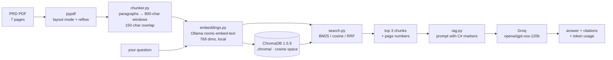

# Chapter 10 — PRD RAG Explorer

A deliberately small, **fully observable** Retrieval-Augmented Generation app over a confidential
product requirements document. Nothing is hidden inside a framework: you can watch the PDF become
pages, the pages become chunks, the chunks become 768-dimension vectors, the vectors land in a real
vector database, and a search decide which three chunks get sent to the LLM.

**Source document:** `Product Requirements Document_ VWO Login Dashboard.pdf` (7 pages, 186 KB)

---

## 1. What you can see in the UI

| Tab | What it shows |
| --- | --- |
| **1 · Ingest** | The extracted PDF (page by page, with the extraction mode used), chunk-size/overlap sliders, a timed pipeline stepper, a proportional chunk map, the chunk table (pages, chars, est. tokens, overlap, vector norm) and a **vector inspector** — all 768 weights as a heatmap plus the raw numbers |
| **2 · Search** | One query run through **three retrievers at once** (BM25, cosine, RRF hybrid), top-3 side by side, each with the arithmetic that produced its score, plus the **query embedding itself** as a heatmap |
| **3 · Chat** | The RAG loop end to end: question → local embedding → ChromaDB retrieval → Groq `openai/gpt-oss-120b` → grounded answer with **clickable `[C#]` citations** that open the exact chunk and its vector, plus tokens, latency and cost |

---

## 2. Architecture



### The stack, and what it deliberately excludes

| Role | Used | Not used |
| --- | --- | --- |
| Embeddings (local) | **`nomic-embed-text` via local Ollama** — 768 dims, free, offline | Chroma's default ONNX MiniLM, `sentence-transformers`, `fastembed` |
| Embeddings (deployed) | **Qdrant Cloud Inference** — a model labelled *Cost: Free*, computed server-side | OpenAI, Cohere, or any paid embedding API |
| Vector database | **ChromaDB `1.5.9`** embedded locally; **Qdrant Cloud** in production | FAISS, pgvector, Pinecone, Chroma Cloud |
| Generation | **Groq `openai/gpt-oss-120b`** over the OpenAI-compatible endpoint | any other LLM |
| Keyword search | hand-written **BM25** (k1=1.5, b=0.75) so the maths is visible | `rank_bm25` |
| Web layer | FastAPI (holds the key) + Vite/React (never sees it) | serverless, auth, streaming |

Those are the **local development** defaults, and local development is unaffected by the deployment
work. On Vercel the same code runs with a hosted embedder and a remote vector database, selected
purely by environment variables — and the whole production path is **free tier only**:

| Concern | Local | Vercel (free tier) |
| --- | --- | --- |
| Embeddings | `EMBEDDING_PROVIDER=ollama` (nomic, 768d) | `EMBEDDING_PROVIDER=qdrant` (Cloud Inference free model, 384d) |
| Vector store | `VECTOR_STORE=chroma` | `VECTOR_STORE=qdrant` (remote cluster) |
| Key needed | none (Ollama is local) | `QDRANT_API_KEY` only — **no** `OPENAI_API_KEY` |
| PDF | read from disk | uploaded through the Ingest tab |

See **[DEPLOYMENT.md](DEPLOYMENT.md)** for the full architecture, environment variables and commands.

> **Why local embeddings?** Groq has no embeddings endpoint. Ollama is already running on this
> machine with `nomic-embed-text` pulled, so the vectors — and the entire PRD — stay on disk. Only
> the final prompt (question + the 3 retrieved chunks) leaves the machine.

---

## 3. Quick start

Two processes: the API (which owns the Groq key and ChromaDB) and the UI.

```bash
cd chapter_10_RAG_Basics

# 1) one-time setup — CPython 3.13 (chromadb 1.5.9 is already proven on this interpreter)
#    requirements-local.txt = the production set + chromadb + uvicorn
uv venv --python 3.13 .venv
uv pip install --python .venv/Scripts/python.exe -r requirements-local.txt

# 2) API on :8011
.venv/Scripts/python.exe -m uvicorn server.main:app --host 127.0.0.1 --port 8011

# 3) UI on :5190 (separate terminal)
cd web && npm install && npm run dev
```

Open **http://localhost:5190**.

> `requirements.txt` is what **Vercel** installs and deliberately excludes ChromaDB and uvicorn;
> `requirements-local.txt` includes it and adds them. Local development always uses the latter.

If you open this folder in VS Code, `Tasks: Run Task` also offers
`RAG: 1 · setup venv + deps (local)`, `RAG: 2 · run API`, `RAG: 3 · run UI`,
`RAG: selfcheck`, `RAG: api smoke test` and `RAG: qdrant inference unit tests`.

### Prerequisites

* **Ollama running** with the embedding model pulled: `ollama pull nomic-embed-text`
  (verify with `curl http://localhost:11434/api/tags`)
* **`GROQ_API_TOKEN`** in `chapter_10_RAG_Basics/.env` (already present). The API reads
  `GROQ_API_TOKEN`, falling back to `GROQ_API_KEY`.
* Node 18+ and `uv` on PATH.

### Verified on this machine

```
pages             7 (7 with text, 0 empty)  ·  extraction mode: layout × 7
characters        9,594   words 1,209   paragraphs 151
chunks            13  (min 599 / avg 870 / max 946 chars, 800 target, 150 overlap)
embeddings        13 × 768 dims via Ollama /api/embed, 1 batch, ~229 ms/chunk
pipeline          3.9 s total  (read 0.6 s · chunk 1 ms · embed 3.1 s · store 60 ms)
chroma            collection prd_d622cb8f_c800_o150, 13 rows, cosine space
cosine cross-check manual cos θ 0.752420 == 1 − chroma_distance 0.752420  ✅
grounded answer   788 prompt / 577 completion tokens, ~3.0 s, citations C1→c0003, C2→c0002, C3→c0004
refusal check     "What are the acceptance criteria…?" → "The document does not contain this information."
```

---

## 4. How the ingestion actually works

`server/ingest.py` runs four stages and times each one.

**1. Extract (`pdf_loader.py`).** `pypdf` in `extraction_mode="layout"`, because this particular PDF
is a design-tool export that emits **one word per line** — 215 lines per page, 100% of them three
words or fewer. Feeding that into a chunker destroys every paragraph. So the loader:

* asks for layout mode first (real visual lines: 30 per page),
* detects the broken word-per-line case (≥ 60% of lines ≤ 3 words) and reflows the raw stream
  instead, so it still works on PDFs that don't support layout mode,
* rebuilds paragraphs: a new one starts when the previous line looks finished (terminal punctuation)
  or was a heading, and bullets always start a paragraph,
* fixes ligatures (`ffi` → `ffi`), smart quotes and stray whitespace,
* records which mode produced each page, so the UI can show it.

Result: **49 real headings** recovered (`Executive Summary`, `Security Specifications`,
`Success Metrics and KPIs`, …) and 151 paragraphs instead of 1,205 one-word lines.

**2. Chunk (`chunker.py`).** Paragraphs are the atomic unit. Oversized paragraphs are split on
sentence boundaries (then on word boundaries as a last resort), units are greedily packed up to
`chunk_size`, and each chunk after the first is prefixed with the last `overlap` characters of its
predecessor so nothing straddles a boundary and disappears. Each chunk keeps its page span, its
character span in the normalised document, and a `c0007-948fa6` id derived from its position plus a
hash of its text — so a changed document can never silently reuse a stale id.

**3. Embed (`embeddings.py`).** Ollama `/api/embed`, batched 32 at a time, with a fallback to the
legacy `/api/embeddings` for older builds. Documents are embedded as
`search_document: …` and queries as `search_query: …` (toggle in the UI) because that is how
`nomic-embed-text` was trained — and you can watch the scores move when you turn it off.

**4. Store (`vector_store.py`).** A Chroma collection whose name is fingerprinted from
`pdf sha1 + chunk size + overlap + model`, created with `hnsw:space=cosine`. Vectors are **always
passed explicitly** — Chroma is never asked to embed anything, so its default ONNX model is never
downloaded and `nomic-embed-text` stays the only embedder. Re-ingesting deletes and rebuilds the
collection, because a re-chunk changes every id and stale rows would otherwise pollute retrieval.

---

## 5. The three search algorithms

All three run on every search over the same chunks, so the differences are visible rather than
asserted.

**BM25 (keyword).** Exact term matching with saturation and length normalisation:

$$\text{score}(q,d)=\sum_{t \in q} \underbrace{\ln\!\left(1+\frac{N-df_t+0.5}{df_t+0.5}\right)}_{\text{idf}} \cdot \frac{tf_{t,d}\,(k_1+1)}{tf_{t,d}+k_1\left(1-b+b\,\frac{|d|}{\text{avgdl}}\right)}$$

The UI prints every term's `tf`, `df`, `idf`, tf-weight and contribution, plus which query terms are
absent from the document entirely. Great for `VWO-1234`, `SSO`, `SAML`; blind to paraphrase.

**Cosine (vector).** $\cos\theta = \frac{q \cdot d}{\lVert q \rVert \lVert d \rVert}$ over the stored
768-dim vectors. The UI shows the dot product, both norms, the top 5 contributing dimensions, and —
as a cross-check — the distance Chroma itself stored, where `similarity = 1 − distance`. If the two
ever disagree, the maths is wrong, not Chroma.

**RRF (hybrid, the default).** Reciprocal Rank Fusion, deliberately score-scale-free:

$$\text{RRF}(d)=\sum_{r \in \{\text{bm25},\,\text{cosine}\}} \frac{1}{k + \text{rank}_r(d)}, \qquad k=60$$

A chunk ranked #1 by both retrievers scores 0.032787; the UI shows each list's rank and each
`1/(k+rank)` contribution, so you can see a chunk being rescued by one retriever or sunk by the other.

---

## 6. API reference

| Method | Route | Purpose |
| --- | --- | --- |
| GET | `/api/health` | Ollama + model, Groq key *and* whether `openai/gpt-oss-120b` exists in your account, Chroma collections, PDF presence, warnings |
| GET | `/api/config` | Public config (never the key) |
| GET | `/api/documents` | Ingested collections with row counts and chunk settings |
| POST | `/api/ingest` | `{pdf_path?, chunk_size?, overlap?, use_prefixes?}` → full timed artifact |
| GET | `/api/chunks/{collection}` | Chunk table, rebuilt from ChromaDB (so it survives restarts) |
| GET | `/api/chunks/{collection}/{chunk_id}/vector` | The full 768-dim vector for the heatmap |
| POST | `/api/search` | `{query, top_k?, use_prefixes?}` → top-k for all three retrievers + query vector + timings |
| POST | `/api/chat` | `{question, mode?, top_k?}` → grounded answer, citations, usage, cost |
| DELETE | `/api/collections/{collection}` | Drop a collection |

Interactive docs: <http://127.0.0.1:8011/docs>

---

## 7. Teaching notes and gotchas

* **This PRD has no "Acceptance Criteria" section.** Asking for one returns
  *"The document does not contain this information."* — and that is the correct answer. An earlier
  build of the prompt produced a confident list under an invented "Acceptance criteria" heading; the
  fix was a prompt rule against renaming sections plus a refusal rule that forbids "adjacent"
  answers. It is a good live demo of why grounding rules matter.
* **Top-K is the main quality knob for the chat.** This document only produces 13 chunks, so top-3 is
  a narrow window: BM25's #4 can be the chunk a human wanted. The Chat tab has its own retriever and
  top-K selector — raise it and watch the answer change.
* **Chunk ids change when the chunking changes**, hence the fingerprinted collection name and the
  rebuild-on-re-ingest behaviour.
* **Chroma's HNSW index is approximate.** Ties and near-ties can order differently between the exact
  cosine computation and Chroma's search; the search response reports both.
* **`round()` on a numpy float returns a numpy float**, which FastAPI cannot serialise — this caused a
  500 on `/api/search` until the BM25 term weights were cast with `float()`. `/api/health` also warns
  if the configured Groq model id is not in your account, since model ids drift.
* **Cost estimates come from editable rates.** `GROQ_PRICE_IN` / `GROQ_PRICE_OUT` in `.env` default to
  $0.15 / $0.75 per 1M tokens and are labelled "verify current rates" in the UI — token counts and
  latency are the measured facts.
* **Token counts on chunks are estimated** as characters ÷ 4; no tokenizer dependency is installed.
* OCR is out of scope: pages that yield no text are reported in the UI instead of silently ignored.

---

## 8. Troubleshooting

| Symptom | Fix |
| --- | --- |
| `Ollama is up but 'nomic-embed-text' is not pulled` | `ollama pull nomic-embed-text` |
| `Could not reach Ollama` | Start it: `ollama serve` |
| Chat fails with 503 | `GROQ_API_TOKEN` missing/expired, or the model id is not in your account — check `/api/health` |
| Deployed app says embeddings are not configured | Set `EMBEDDING_PROVIDER=qdrant`, `VECTOR_STORE=qdrant`, `QDRANT_URL`, `QDRANT_API_KEY` in Vercel |
| Ingest fails with *"… is not found among supported models. Check if `cloud_inference` is set to True or `fastembed` is installed"* | The Qdrant **client** was built without `cloud_inference=True`, so it tried to embed locally. Fixed in `server/vector_store.py`; also make sure `qdrant-client>=1.13.1` (1.12.0 has no such argument) |
| Local and deployed show different documents | `QDRANT_EMBED_MODEL` casing differs — it feeds the collection name, so use the console's exact spelling in both places |
| `Vector dimension error` on ingest | `QDRANT_COLLECTION_PREFIX` points at an existing collection of a different width — use a new prefix, or set `QDRANT_EMBED_DIMS` to the model's real size |
| UI shows "Could not reach the RAG API" | The API process is not running on :8011 (restart it; the Vite proxy reports 500 when the backend is down) |
| `Could not satisfy the request Accept-Encoding header` style proxy noise | Reload the page after restarting the API |
| Want a clean slate | `Delete collection` in the UI, or remove `.chroma/` |

---

## 9. Files

```
chapter_10_RAG_Basics/
├── .env                                  # GROQ_API_TOKEN, OLLAMA_URL (gitignored)
├── .env.example                          # every variable, local + production
├── Product Requirements Document_ ...pdf # the source document (gitignored — confidential)
├── requirements.txt                      # what Vercel installs (lean, no chromadb/uvicorn)
├── requirements-local.txt                # the above + chromadb + uvicorn (local development)
├── vercel.json, .vercelignore, .python-version   # Vercel build + what never gets uploaded
├── DEPLOYMENT.md                         # production architecture, env vars, deploy steps
├── api/index.py                          # Vercel entrypoint → re-exports server.main:app
├── scripts/
│   ├── selfcheck.py                      # ingest → search → chat → refusal, no HTTP
│   ├── api_smoke.py                      # every route (in-process, or --url to test a deployment)
│   └── test_qdrant_inference.py          # 30 assertions on the Cloud Inference path (stubbed cluster)
├── server/
│   ├── config.py         # every path/model/rate + provider selection; the only reader of os.environ
│   ├── pdf_loader.py     # layout extraction + reflow + paragraph recovery
│   ├── chunker.py        # paragraph-aware overlapping chunks with page/char spans
│   ├── embeddings.py     # Ollama client, Qdrant Cloud Inference descriptor, vector statistics
│   ├── vector_store.py   # ChromaDB (embedded, local) or Qdrant (remote) behind one interface
│   ├── search.py         # BM25 + cosine + RRF, each with its full arithmetic
│   ├── rag.py            # grounded prompt, Groq call, citation parsing, usage/cost
│   ├── ingest.py         # the timed pipeline
│   └── main.py           # FastAPI routes (the only place the key is used)
└── web/                  # Vite 7 + React 19 UI
    └── src/components/   # StatusBar, IngestPanel, VectorHeatmap, ChunkDetail,
                          # SearchPanel, ResultCard, ScoreMath, ChatPanel, CostPanel
```

`scripts/selfcheck.py` is the fastest way to prove the whole stack works:

```bash
.venv/Scripts/python.exe scripts/selfcheck.py
```

`scripts/api_smoke.py` checks every HTTP route — locally in-process, or against a deployment:

```bash
.venv/Scripts/python.exe scripts/api_smoke.py
.venv/Scripts/python.exe scripts/api_smoke.py --url https://your-project.vercel.app
```

`scripts/test_qdrant_inference.py` verifies the free-tier embedding path against a stubbed cluster,
so it needs no credentials and no network:

```bash
.venv/Scripts/python.exe scripts/test_qdrant_inference.py
```
